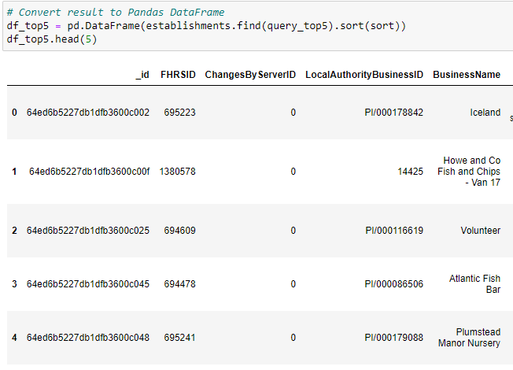
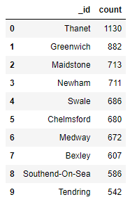

# Food magazine, Eat Safe, Love - Analyses

## Database and Jupyter Notebook Set Up
1.Import the data provided in the establishments.json file from your Terminal. Name the database uk_food and the collection establishments. Copy the text you used to import your data from your Terminal to a markdown cell in your notebook.
        Import the dataset with mongoimport --type json -d uk_food -c establishments --drop --jsonArray establishments.json

2.Import the libraries you need: PyMongo and Pretty Print (pprint).
        from pymongo import MongoClient
        from pprint import pprint

3.Create an instance of the Mongo Client.
        mongo = MongoClient(port=27017)

4.Confirm that you created the database and loaded the data properly:
        List the databases you have in MongoDB. Confirm that uk_food is listed.
            print(mongo.list_database_names()) --> 'admin', 'autosaurus', 'classDB', 'config', 'epa', 'fruits_db', 'gardenDB', 'local', 'met', 'petsitly_marketing', 'travel_db', 'uk_food']

        List the collection(s) in the database to ensure that establishments is there.
            ['establishments']

        Find and display one document in the establishments collection using find_one and display with pprint.
            In file 

5.Assign the establishments collection to a variable to prepare the collection for use.
        establishments = db['establishments']

##  Update the Database
The magazine editors have some requested modifications for the database before you can perform any queries or analysis for them. Make the following changes to the establishments collection:
                    {
                    "BusinessName":"Penang Flavours",
                    "BusinessType":"Restaurant/Cafe/Canteen",
                    "BusinessTypeID":"",
                    "AddressLine1":"Penang Flavours",
                    "AddressLine2":"146A Plumstead Rd",
                    "AddressLine3":"London",
                    "AddressLine4":"",
                    "PostCode":"SE18 7DY",
                    "Phone":"",
                    "LocalAuthorityCode":"511",
                    "LocalAuthorityName":"Greenwich",
                    "LocalAuthorityWebSite":"http://www.royalgreenwich.gov.uk",
                    "LocalAuthorityEmailAddress":"health@royalgreenwich.gov.uk",
                    "scores":{
                        "Hygiene":"",
                        "Structural":"",
                        "ConfidenceInManagement":""
                    },
                    "SchemeType":"FHRS",
                    "geocode":{
                        "longitude":"0.08384000",
                        "latitude":"51.49014200"
                    },
                    "RightToReply":"",
                    "Distance":4623.9723280747176,
                    "NewRatingPending":True
                }
1.An exciting new halal restaurant just opened in Greenwich, but hasn't been rated yet. The magazine has asked you to include it in your analysis.
        establishments.insert_one(new_resto)

2.Find the BusinessTypeID for "Restaurant/Cafe/Canteen" and return only the BusinessTypeID and BusinessType fields.
                {'_id': ObjectId('64ed6b5127db1dfb360049b7'),
        'BusinessType': 'Restaurant/Cafe/Canteen',
        'BusinessTypeID': 1}

3.Update the new restaurant with the BusinessTypeID you found.
        establishments.update_one(new_resto, {"$set": {"BusinessTypeID":1}})

4.The magazine is not interested in any establishments in Dover, so check how many documents contain the Dover Local Authority. Then, remove any establishments within the Dover Local Authority from the database, and check the number of documents to ensure they were deleted.
        establishments.count_documents({"LocalAuthorityName":"Dover"})
        answer:994
        establishments.delete_many({"LocalAuthorityName":"Dover"}) --> establishments.count_documents({"LocalAuthorityName":"Dover"}) --> answer: 0   

5.Some of the number values are stored as strings, when they should be stored as numbers.
        Use update_many to convert latitude and longitude to decimal numbers.
        Use update_many to convert RatingValue to integer numbers.
            -results
                            {'RatingValue': 5,
            '_id': ObjectId('64ed6b5127db1dfb36004c9d'),
            'geocode': {'latitude': Decimal128('51.08084'),
                        'longitude': Decimal128('1.188537')}}

##  Exploratory Analysis
Eat Safe, Love has specific questions they want you to answer, which will help them find the locations they wish to visit and avoid.

Which establishments have a hygiene score equal to 20?
        Number of establishments with a hygiene score of twenty: 41

Which establishments in London have a RatingValue greater than or equal to 4?
        Number of establishments with London as the Local Authority and a RatingValue greater than or equal to four: 33

What are the top 5 establishments with a RatingValue of 5, sorted by lowest hygiene score, nearest to the new restaurant added, "Penang Flavours"?

How many establishments in each Local Authority area have a hygiene score of 0? Sort the results from highest to lowest, and print out the top ten local authority areas
        Top 10
        
